# 一个“链下决策，链上执行”自动化的全栈原型

**一个以python脚本驱动链上交易的原型**

## 项目目标

1.  **项目目标：**
    * 实现一个原型，模拟“链下（Off-Chain）”系统（Python 脚本）做出决策，并安全地触发“链上（On-Chain）”合约（Solidity）执行一笔转账。
2.  **核心架构：**
    * **链上执行器 (Executor.sol):** 一个持有资金的 `Ownable` 智能合约。
    * **链下决策者 (Wallet A):** 一个 Python 脚本，它持有合约“Owner”的私钥，用于签署和发送“指令”交易。
    * **目标接收者 (Wallet B):** 接收资金的目标钱包。
3.  **技术栈：**
    * **云服务器：** `root@iZ6web...` (作为开发与执行环境)
    * **链上：** Hardhat (v3.x), Solidity (v0.8.20), Ethers.js
    * **链下：** Python, `web3.py` (v6.x/v7.x)
    * **网络：** Sepolia 测试网
    * **节点：** Alchemy RPC


## 准备工作

### 两个MetaMask钱包

两个转账的地址由MetaMask生成，一个用于转账，一个用于接受转账。

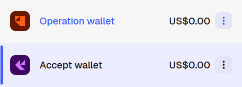

你需要保存两个地址和对应的私钥。以一个为例：

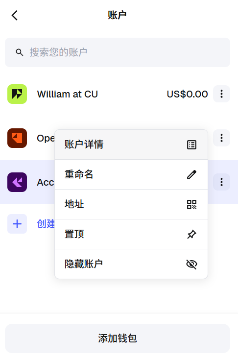

地址是在：
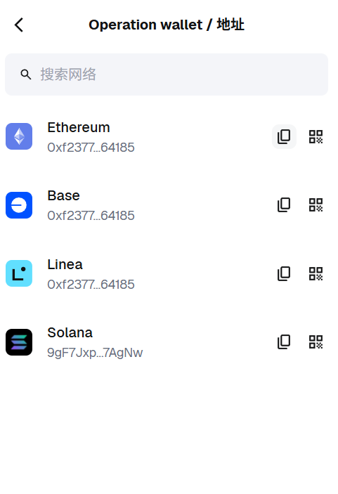

请注意，如果直接复制，会出现这样的格式：0x4d90a7e1bba47cec28678167f8e6e3988b295df1，前头是带有0x标志的，这在构建项目的时候要注意，有时候可能会要求带有0x,有时候则不要求。

私钥点进去复制下来：
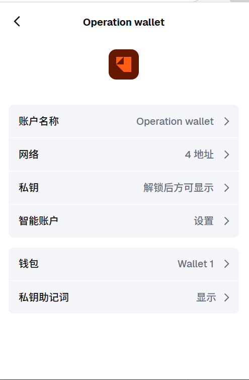

注意，这里出现了刚刚所说的不带有0x的私钥的问题。你要人为的更改。例如，复制下来的私钥是：331b43ac6d34d11e172582410bdd3adjc31fa4cnce484229be07635d6ee90c34

你在记录的时候要记录为：
0x331b43ac6d34d11e172582410bdd3adjc31fa4cnce484229be07635d6ee90c34

### 获取测试币

测试的时候需要虚拟币，你才能够测试交易。这种币叫做sepolia。在本例中，使用的测试币是SepoliaETH。
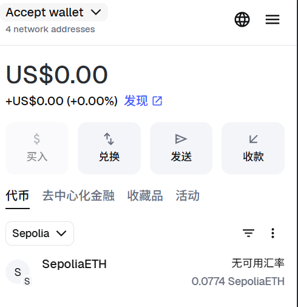

那么，如何获取测试币？市面上有很多水龙头faucet可以提供免费的测试币。但是，很多都需要你拥有一点真正的ETH，或者需要你去链接一些现有的平台账号。这些都比较麻烦。很简单并且很可行的方式是：sepolia pow faucet（https://sepolia-faucet.pk910.de/）。它用你的算力（Pow）交换一些sepolia。

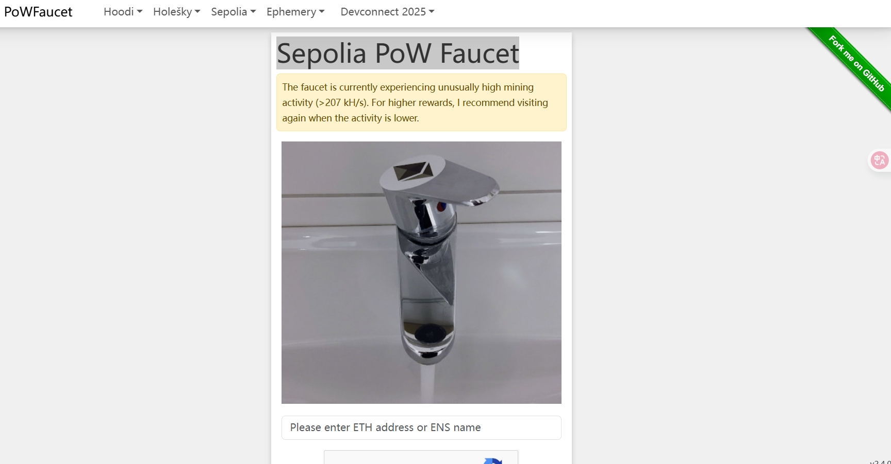

你只需要填写地址，然后等待一段时间，当足额之后你的钱包就能收到sepolia。

### 租用服务器

我使用的平台是阿里云ECS（国内）。相关的配置如下：

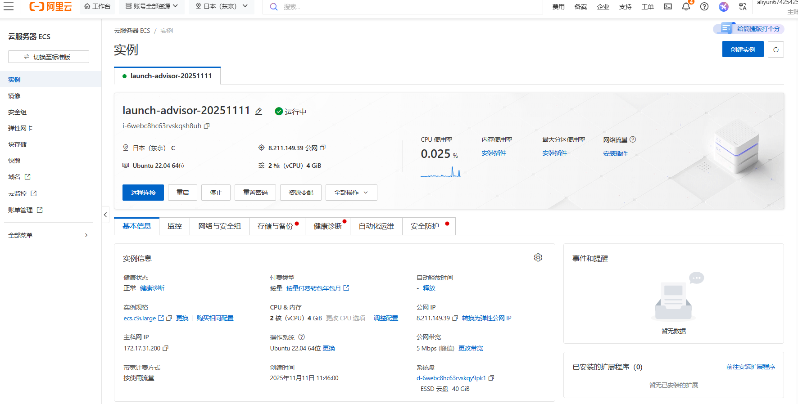

没有什么要着重配置的，一小时大约RMB0.6。

### 配置环境

我使用的是VSCode的ssh连接。

你可能遇到的问题有：
    .pem文件的权限设置错误导致无法正常连接。相关的解决办法请见：
    https://github.com/williamtage5/LLAMA-Factory-Example/blob/main/Web_UI/web_ui_example-cn.md

#### 创建目录

我想要在root下面的contract来编写整个项目。所以你可以建立一个文件夹

```bash
makedir /contract
```

如果之前有内容，请你运行下面的来清空（当然当部分出错或者需要重新进行时候你也可以这样清空）：

```bash
# 1. 首先，确保你位于正确的目标目录中
cd ~/contract

# 2. 删除所有非隐藏文件和目录
rm -rf *

# 3. 删除所有隐藏文件和目录 (例如 .git, .gitignore, .env)
#    这个命令会安全地跳过 "." (当前目录) 和 ".." (父目录)
rm -rf .[!.]*

# 4.  验证目录是否已空
echo "目录 ~/contract/ 已被清空。当前内容："
ls -la
```

#### 安装Hardhat(Node.js)


##### Hardhat (Node.js)介绍

简单来说，**Hardhat 是一个专业、灵活的以太坊（及其他EVM兼容链）智能合约开发环境**。它是一个基于 Node.js 的工具，极大地简化了构建、测试和部署去中心化应用（DApps）的完整工作流程。

您可以将它理解为智能合约开发者的“瑞士军刀”或“集成开发环境（IDE）”，它通过自动化和工具集成为您处理了大量繁琐的底层工作。

1. 为什么它与 Node.js 相关？

您提到“Hardhat (Node.js)”是完全正确的。Hardhat 本身就是一个 **Node.js 库**。

* **安装方式：** 您通过 `npm`（Node.js 的包管理器）来安装 Hardhat。
* **运行环境：** 您的整个项目配置（`hardhat.config.js`）、自动化脚本和测试用例通常都是用 **JavaScript** 或 **TypeScript** 编写的，并运行在 Node.js 环境中。
* **生态系统：** 它可以无缝集成其他流行的 Node.js 库（例如 `Ethers.js` 或 `Web3.js`）来与智能合约进行交互。

2. Hardhat 的核心功能与优势

Hardhat 之所以广受欢迎，是因为它提供了几个强大的核心功能：

* Hardhat Network（本地开发网络）
    这是 Hardhat 最出色的功能之一。它是一个专为开发而设计的本地以太坊网络节点，**直接在您的计算机内存中运行**。

    * **速度极快：** 交易和挖矿瞬间完成，非常适合运行自动化测试。
    * **强大的调试能力：**
        * **Solidity `console.log`：** 允许您像在 JavaScript 中一样，直接在您的 Solidity 智能合约中添加 `console.log()` 语句，并在运行测试时查看输出。
        * **详细的错误报告：** 当交易失败时，Hardhat 会提供清晰的 Solidity 堆栈跟踪（Stack Traces），准确告诉您是哪一行代码出了问题。
    * **模拟状态（Forking）：** 它可以“分叉”以太坊主网或任何测试网。这意味着您可以在本地创建一个包含所有主网真实数据（账户、合约、余额）的副本，并在这个“沙盒”环境中与主网合约进行交互和测试，而无需花费真实的 Gas 费。

* Hardhat Runner（任务运行器）
    这是一个灵活的任务运行器，允许您通过命令行（CLI）执行各种预定义或自定义的任务。

    * **内置任务：**
        * `npx hardhat compile`：编译您的 Solidity 合约。
        * `npx hardhat test`：运行您的自动化测试（通常使用 Mocha 和 Chai）。
        * `npx hardhat node`：启动一个本地的 Hardhat Network 节点，供您的前端应用连接。
    * **自定义任务：** 您可以轻松编写自己的脚本（例如部署合约、与特定合约交互）并将其定义为 Hardhat 任务。

* 灵活的插件（Plugin）系统
    Hardhat 的核心非常精简，其大部分功能都是通过插件实现的。这使它具有极高的可扩展性。

    * **官方插件：** 例如 `@nomicfoundation/hardhat-toolbox`（一个包含所有入门所需工具的“工具箱”）、`hardhat-ethers`（集成 Ethers.js）、`hardhat-verify`（在 Etherscan 上自动验证合约源码）。
    * **社区插件：** 有大量由社区开发的插件，用于 Gas 报告、代码覆盖率分析、安全审计等。

* 强大的测试支持
    Hardhat 为智能合约测试提供了世界一流的支持。您可以使用 JavaScript/TypeScript 配合 **Ethers.js**、**Mocha**（测试框架）和 **Chai**（断言库）来编写功能强大且易于阅读的自动化测试用例。

3. 一个典型的工作流程

使用 Hardhat，开发者的工作流程通常如下：

1.  **初始化项目：** 运行 `npx hardhat` 在一个空目录中创建一个新的 npm 项目。
2.  **编写合约：** 在 `contracts/` 目录下编写您的 `.sol` 智能合约文件。
3.  **编写测试：** 在 `test/` 目录下使用 JavaScript/TypeScript 编写测试用例。
4.  **本地测试：** 运行 `npx hardhat test`。Hardhat 会自动编译合约，并在内存中的 Hardhat Network 上运行所有测试，然后提供详细报告。
5.  **编写部署脚本：** 在 `scripts/` 目录下创建一个 `deploy.js` 脚本。
6.  **部署到网络：** 运行 `npx hardhat run scripts/deploy.js --network goerli`（或其他网络名称，如 `mainnet`）来将您的合约部署到公共网络。

对于任何严肃的智能合约开发者来说，Hardhat 都是一个必备工具。它通过提供一个强大的、集成的、基于 Node.js 的环境，极大地提高了开发、测试和调试的效率和可靠性。

##### 具体操作

**不使用**下面的安装，因为2.X版本已经老了：

```bash
npx hardhat init
```

而是使用：
```bash
npx hardhat --init
```

随后出现一系列安装的偏好请你选择。

选这个第一个：
```bash
👷 Welcome to Hardhat v3.0.13 👷


? Which version of Hardhat would you like to use? … 

▸ Hardhat 3 Beta (recommended for new projects)

  Hardhat 2 (older version)
```

选择第二个，随后我们为了补全一些依赖环境我们需要一些额外的操作：
```bash
Please provide either a relative or an absolute path: · .

? What type of project would you like to initialize? … 

▸ A TypeScript Hardhat project using Node Test Runner and Viem

  A TypeScript Hardhat project using Mocha and Ethers.js

  A minimal Hardhat project
```

选择true:
```bash
Do you want to run it now? (Y/n) ‣ true
```
#### 安装Python环境

我准备在contract目录下面再创建一个文件夹offchain_scripts用来存放我的python制作决策的部分。
```bash
# 1. 创建目录
mkdir offchain_scripts

# 2. 创建虚拟环境
python3 -m venv py_env

# 3. 激活虚拟环境
source py_env/bin/activate

# 4. 安装 Python 依赖
pip install web3 python-dotenv
```

随后你要点击VSCode里左上角的文件，然后选择打开文件夹，选择`contract`这个文件夹打开，我们之后就在这里面编写。
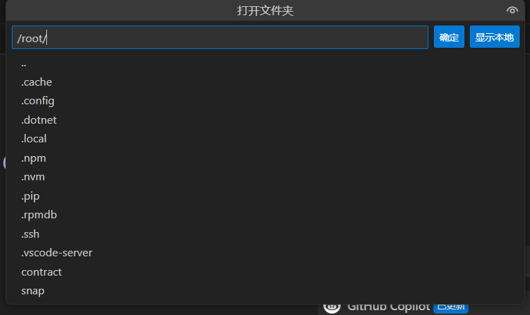

打开之后你的完整的目录应该是：
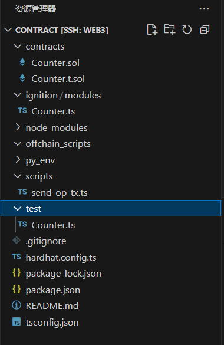

## 编写链上智能合约

### 清理原来的示例文件


```bash
# 1. 删除默认的合约
rm contracts/Counter.sol
# 'Counter.t.sol' 似乎是 Foundry 测试文件，也一并删除
rm contracts/Counter.t.sol

# 2. 删除默认的 ignition 部署模块 (我们不用 ignition)
rm ignition/modules/Counter.ts

# 3. 删除默认的测试文件
rm test/Counter.ts

# 4. 删除默认的 scripts 文件 (我们将创建自己的 deploy.ts)
rm scripts/send-op-tx.ts
```


### 创建Executor.sol

创建新文件 ~/contract/contracts/Executor.sol，并将以下代码粘贴进去。

```Solidity
// SPDX-License-Identifier: MIT
pragma solidity ^0.8.20;

// 我们从 npm install @openzeppelin/contracts 导入
// 这将处理 Wallet A 的所有权 (Owner)
import "@openzeppelin/contracts/access/Ownable.sol";

/**
 * @title Executor
 * @dev 这个合约由 Wallet A (Owner) 部署。
 * 它持有资金，并根据 Owner 的链下指令，将资金“执行”转账到目标地址。
 */
contract Executor is Ownable {
    
    // 当合约 Owner (Wallet A) 部署时，构造函数会自动运行
    // 部署者 (msg.sender) 将自动被设为 Owner
    // 我们指定 initialOwner 为 'payable'，以便 Ownable 库知道
    constructor() Ownable(payable(msg.sender)) {}

    /**
     * @dev 核心执行函数。
     * 只有 Owner (Wallet A) 才能调用此函数。
     * 它从 *本合约* 的余额中向 'target' 发送 'amount' 的 ETH。
     * @param target 接收 ETH 的目标地址 (例如 Wallet B)
     * @param amount 要发送的 ETH 数量 (以 wei 为单位)
     */
    function executeTransfer(address payable target, uint amount) public onlyOwner {
        require(target != address(0), "Executor: Target address cannot be zero");
        require(address(this).balance >= amount, "Executor: Insufficient funds in contract");

        // 使用 .call() 发送 ETH，这是推荐的安全做法
        (bool success, ) = target.call{value: amount}("");
        require(success, "Executor: Transfer failed");
    }

    /**
     * @dev 紧急提款函数。
     * 允许 Owner (Wallet A) 提取合约中的所有剩余 ETH。
     */
    function withdraw() public onlyOwner {
        uint balance = address(this).balance;
        address payable ownerAddress = payable(owner());
        
        (bool success, ) = ownerAddress.call{value: balance}("");
        require(success, "Executor: Withdraw failed");
    }

    /**
     * @dev 接收 ETH 的函数。
     * 这使得我们可以从 Wallet A 向该合约地址发送 ETH 进行注资。
     * (阶段 4 将会用到)
     */
    receive() external payable {}
}
```

### 编译合约

```bash
# 确保你在 ~/contract 目录下
cd ~/contract

# 编译合约
npx hardhat compile
```

### 配置合约所需要的环境变量

在 ~/contract/ 目录下创建一个新文件 .env。注意，这个文件的全名就是.env，后缀就是.env。

```env
# --- .env ---
# 请用你的实际数据替换 "..." 

# 1. Sepolia RPC URL (例如 "https://eth-sepolia.g.alchemy.com/v2/YOUR_ALCHEMY_KEY")
SEPOLIA_RPC_URL="https://eth-sepolia.g.alchemy.com/v2/QTwdW8jEZXpkx2YUT197r"

# 2. 你的 Wallet A 的私钥 (必须以 0x 开头)
# 这个钱包将部署合约并成为 Owner，还记得我们之前讲的复制的时候并没有带0x吗？这里要手动加上
# 不需要有 Wallet A 的地址，因为可以从私钥推出公钥的地址，请见后续的操作。
WALLET_A_PRIVATE_KEY="0x331b43ac6e34d11e162582440bdd3ad8f31fa4c4ce484229be07635d6ee90c34"

# 3. 你的 Wallet B 的公开地址 (用于 Python 脚本)
WALLET_B_ADDRESS="0x4d90a7e1bba47cec28678167f8e6e3988b295df1"

# 4. 部署的合约地址 (现在还没有)
CONTRACT_ADDRESS="0x098ca3659853743d4c6bf166FbF1dfb94Dc3b9e9"
```

关于Sepolia RPC URL的获取，请你参考如下操作：

1. 打开https://dashboard.alchemy.com/，你可以将其理解为一个中间商，便于我们将自己的合约所发出的交易同步到想要同步的链上。

2. 点击create new app

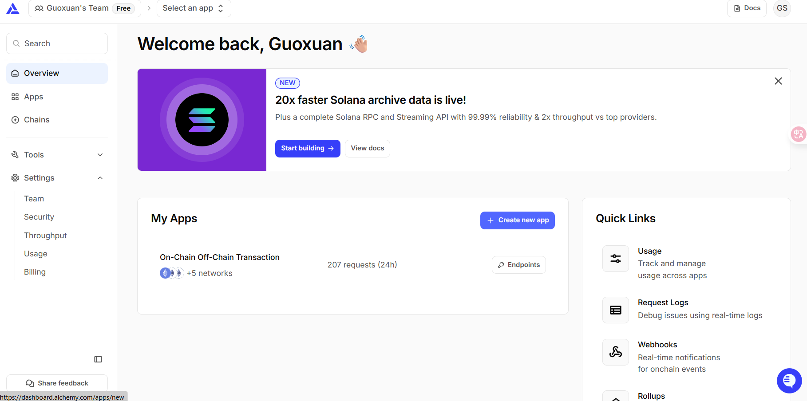

按照下面的操作填写信息，其实随便填无所谓：
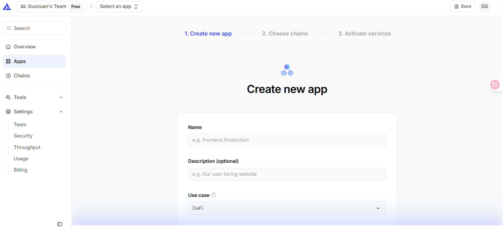

第二部要选择ETH，因为我们使用的测试币是Sepolia ETH。


下一步随便填，这个项目并没有用到相关的功能。
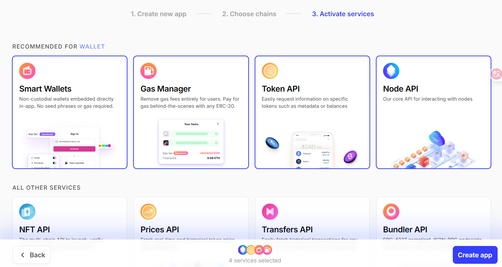

3. 测试app是否创建成功

你创建好之后会进入到这个界面。
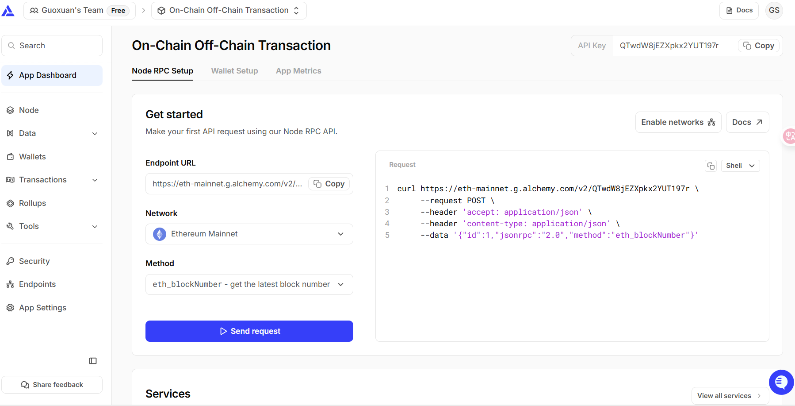

把network设置成为ethereum sepolia。
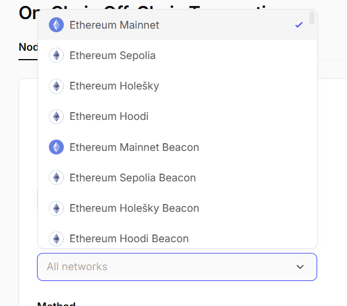

点击send request 测试是否成功。成功的结果应该如下：
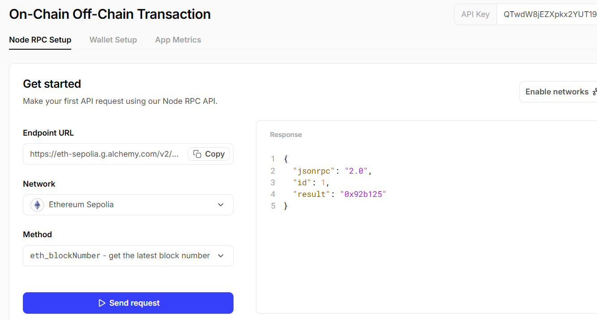

如果显示出错需要授权，你可以选择等待一段时间，系统需要审核你的app申请，你也可以创建一些app看哪个快。但是一定要这一步测试成功。

4. 复制endpoint url
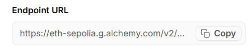

记录下来这个url。就是Sepolia RPC URL。

### 修改.gitignore

主要是为了确保删除和修改的时候.env文件不会被操作。

在.gitignore的文件的最后加上`.env`。整体文件的内容如下：

```
# Node modules
/node_modules

# Compilation output
/dist

# pnpm deploy output
/bundle

# Hardhat Build Artifacts
/artifacts

# Hardhat compilation (v2) support directory
/cache

# Typechain output
/types

# Hardhat coverage reports
/coverage

.env
```

### 编写Hardhat配置文件

这是关键。请完全替换 ~/contract/hardhat.config.ts 文件的内容为以下代码。

此配置会：

加载 .env 文件 (通过 dotenv/config)。

配置 sepolia 网络，使用你的 SEPOLIA_RPC_URL 和 WALLET_A_PRIVATE_KEY。

设置 Solidity 编译器版本以匹配我们的合约（0.8.20）。

文件位置: ~/contract/hardhat.config.ts

在编写过程中你可能需要经常刷新ts，来确定是否编译成功。

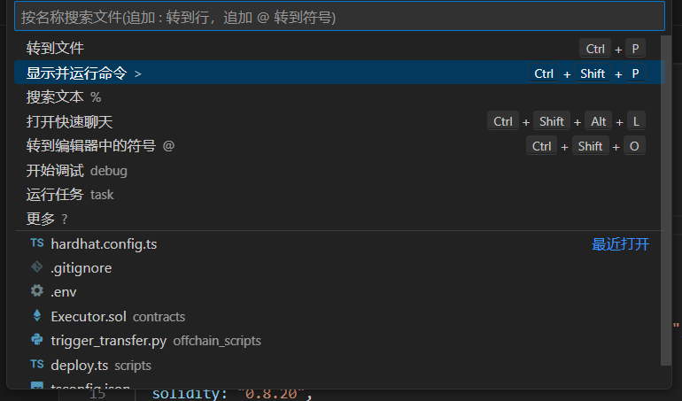
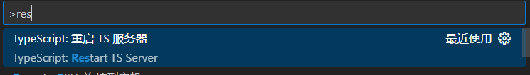


```ts
import { HardhatUserConfig } from "hardhat/config";

// 1. (关键!) 只导入我们刚刚安装的 v3 兼容插件
import "@nomicfoundation/hardhat-ethers";

// 2. (删除) 不再需要 'hardhat-toolbox'
// import "@nomicfoundation/hardhat-toolbox";

import "dotenv/config";

const sepoliaRpcUrl = process.env.SEPOLIA_RPC_URL || "";
const walletAPrivateKey = process.env.WALLET_A_PRIVATE_KEY || "";

const config: HardhatUserConfig = {
  solidity: "0.8.20",
  networks: {
    sepolia: {
      type: "http", 
      url: sepoliaRpcUrl,
      accounts: [walletAPrivateKey],
    },
  },
};

export default config;
```

你可能会遇到：

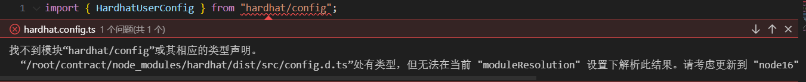

这是一个幽灵错误，原因是你的**终端（Terminal）知道文件在哪里（它是正确的），但你的编辑器（VS Code）**是糊涂的（它是错误的）。你在部署的时候应该是可以跑通的。

### 部署deploy.js脚本

文件位置: ~/contract/scripts/deploy.ts。

这部分要添加一些助手库，否则会出现严重的编译问题。例如：

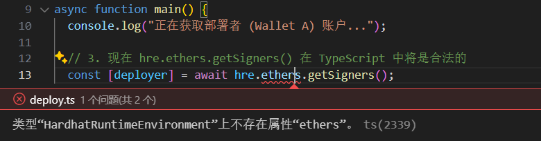

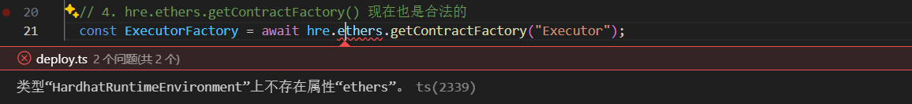


如果不进行助手库的安装，我们在这一阶段遇到了两个核心错误：

  *  错误  ( `ts(2339)` / `TypeError` )：** 我们选择的 Hardhat v3 模板 (`mocha-ethers`) **没有**在“脚本环境” (`npx hardhat run`) 中为 `hre` 对象注入 `.ethers` 助手库。
  *  错误  ( `ERESOLVE` )：** 我错误地建议安装 `hardhat-toolbox` (一个 v2 插件)，导致了与你项目 v3 核心的依赖冲突。

最终解决方案策略：放弃 `hre`

我们的最终策略是：**既然 Hardhat 运行时环境（`hre`）在这个模板中不可靠，我们就完全绕过它。**

我们不再依赖 Hardhat 的“魔法”注入，而是像一个独立的 TypeScript 脚本一样，**手动**导入 Ethers.js 库并执行所有部署步骤。

以下是实现“纯 Ethers.js”手动部署的正确流程。

#### 步骤 1：确保核心依赖已安装

为了让我们的手动脚本正常工作，我们不再需要 `hardhat-toolbox` 或 `hardhat-toolbox-mocha-ethers`。但我们**必须**确保以下两个库已正确安装，因为我们的 `deploy.ts` 脚本直接 `import` 了它们：

1.  **`ethers` 库：** 这是 Ethers.js 的核心库。
2.  **`dotenv` 库：** 用于从 `.env` 文件中加载我们的 `SEPOLIA_RPC_URL` 和私钥。

（在我们之前的调试中，`dotenv` 已经在项目初始化时安装了，`ethers` 也在排错过程中被添加了。）

```bash
# 确保 ethers 和 dotenv 存在
npm install ethers dotenv
```

#### 步骤 2：重写 `scripts/deploy.ts` (你最终的代码)

你的 `~/contract/scripts/deploy.ts` 文件被替换为以下内容。

```typescript
// 1. (新) 导入 "ethers" 库本身，而不是 hardhat
//    ✅ 解决方案：
//    我们不再 `import hre from "hardhat"`。
//    我们直接导入 `ethers` 库，这完全绕过了 Hardhat 运行时（hre），
//    因此 Error 6 (`hre.ethers` 为 undefined) 自动消失了。
import { ethers } from "ethers";

// 2. (新) 导入 "dotenv" 来读取 .env
//    ✅ 解决方案：
//    因为 `hre` 不再为我们自动加载 `.env`，我们必须
//    通过 `dotenv/config` 手动执行此操作。
import "dotenv/config";

// 3. (新) 导入我们编译好的合约 ABI 和 Bytecode
//    (路径 ../ 是从 /scripts 目录返回到根目录)
//    ✅ 解决方案：
//    我们不再使用 `hre.ethers.getContractFactory("Executor")` 来
//    自动查找合约。我们直接从 `artifacts` 目录导入
//    编译后的 JSON 文件，手动获取 ABI 和 Bytecode。
import ExecutorArtifact from "../artifacts/contracts/Executor.sol/Executor.json";

async function main() {
  console.log("正在从 .env 文件加载配置...");

  // 4. (新) 从 .env 获取我们的配置
  //    ✅ 解决方案：
  //    我们不再依赖 `hre.networks`。我们直接通过 `process.env`
  //    读取我们的 RPC URL 和私钥。
  const rpcUrl = process.env.SEPOLIA_RPC_URL;
  const privateKey = process.env.WALLET_A_PRIVATE_KEY;

  if (!rpcUrl) {
    throw new Error("SEPOLIA_RPC_URL 未在 .env 文件中找到");
  }
  if (!privateKey) {
    throw new Error("WALLET_A_PRIVATE_KEY 未在 .env 文件中找到");
  }

  // 5. (新) 设置 Ethers.js Provider 和 Wallet
  //    ✅ 解决方案：
  //    这部分代码是 `hre.ethers.getSigners()` 的“手动”替代品。
  //    我们使用 RPC URL 创建一个 `JsonRpcProvider` (连接)。
  //    我们使用私钥和 `provider` 创建一个 `Wallet` (签名者)。
  const provider = new ethers.JsonRpcProvider(rpcUrl);
  const wallet = new ethers.Wallet(privateKey, provider);
  console.log("已连接到 Wallet A:", wallet.address);
  console.log("---------------------------------");

  // 6. (新) 从 Artifacts 加载 ABI 和 Bytecode
  const abi = ExecutorArtifact.abi;
  const bytecode = ExecutorArtifact.bytecode;

  // 7. (新) 创建合约工厂
  //    ✅ 解决方案：
  //    这是 `hre.ethers.getContractFactory()` 的“手动”替代品。
  //    我们使用 ABI、Bytecode 和我们的 `wallet` (签名者) 
  //    来实例化一个 `ContractFactory`。
  const ExecutorFactory = new ethers.ContractFactory(abi, bytecode, wallet);

  console.log("正在部署 Executor.sol...");
  
  // 8. (新) 部署合约
  const executor = await ExecutorFactory.deploy();
  
  // 等待部署完成
  await executor.waitForDeployment();

  const contractAddress = await executor.getAddress();

  console.log("---------------------------------");
  console.log("✅ 合约 'Executor.sol' 部署成功!");
  console.log("部署者 (Owner):", wallet.address);
  console.log("合约地址 (CONTRACT_ADDRESS):", contractAddress);
  console.log("---------------------------------");
  console.log("请将此合约地址复制到你的 .env 文件和阶段 5 的 Python 脚本中。");
}

main().catch((error) => {
  console.error(error);
  process.exitCode = 1;
});
```

#### 步骤 3：执行脚本

我们使用 `npx hardhat run` 来执行这个脚本。

```bash
# 运行部署脚本
# 注意：此时 --network sepolia 标志实际上被我们的脚本忽略了，
# 因为脚本直接从 .env 读取 RPC URL，而不是从 hardhat.config 读取。
npx hardhat run scripts/deploy.ts --network sepolia
```

**最终结果：** 脚本不再依赖 Hardhat 的（在这个模板中）破碎的运行时环境，而是建立了一个独立、纯粹的 Ethers.js 部署流程，因此 100% 成功了。

#### 步骤4：添加合约地址

你的部署成功的返回应该是：

```bash
root@iZ6webc8hc63rvskqsh8uhZ:~/contract# npx hardhat run scripts/deploy.ts --network sepolia
正在从 .env 文件加载配置...
已连接到 Wallet A: 0xf2377774C453FCdba9d929C193f094e912664185
---------------------------------
正在部署 Executor.sol...
---------------------------------
✅ 合约 'Executor.sol' 部署成功!
部署者 (Owner): 0xf2377774C453FCdba9d929C193f094e912664185
合约地址 (CONTRACT_ADDRESS): 0x098ca3659853743d4c6bf166FbF1dfb94Dc3b9e9
---------------------------------
```

这个合约的地址就是我们操作的合约。请你将这个合约的地址复制进.env文件当中。

```bash
# --- .env ---
# 请用你的实际数据替换 "..." 

# 1. Sepolia RPC URL (例如 "https://eth-sepolia.g.alchemy.com/v2/YOUR_ALCHEMY_KEY")
SEPOLIA_RPC_URL="https://eth-sepolia.g.alchemy.com/v2/QTwdW8jEZXpkx2YUT197r"

# 2. 你的 Wallet A 的私钥 (必须以 0x 开头)
#    这个钱包将部署合约并成为 Owner
WALLET_A_PRIVATE_KEY="0x331b43ac6d34d11e162582410bdd3ad8c31fa4c4ce484229be07635d6ee90c34"

# 3. 你的 Wallet B 的公开地址 (用于 Python 脚本)
WALLET_B_ADDRESS="0x4d90a7e1bba47cec28678167f8e6e3988b295df1"

# 4. 刚刚部署的合约地址
CONTRACT_ADDRESS="0x098ca3659853743d4c6bf166FbF1dfb94Dc3b9e9"
```

### 为合约注资

我们整理的设想是使用python不直接调用wallet A这个钱包，因为一方面直接调用钱包非常不安全，另一方面这个项目是我的一个课题最终想要从特定的合约进行还款，所以这个小项目就直接设想成为使用python去向合约发送命令。所以，需要每次手动给合约来注资，然后使用python脚本调用，从A放在合约里面的钱发送给B。

整个的资金流动是：

1.  **转账资金 (The Transfer Amount):**
    * **金额：** `0.00005 ETH`
    * **来源 (From)：** **合约** (`0x098c...`) 的余额（即我们注资的“保险箱”）
    * **去向 (To)：** `Wallet B` (`0x4d90...`)

2.  **Gas 费 (The "Service Fee"):**
    * **金额：** 一个很小的数额 (例如 `0.000068... ETH`，你可以在 Etherscan 交易详情的 `Transaction Fee` 字段看到)
    * **来源 (From)：** **Wallet A** (`0xf237...`) 的余额
    * **去向 (To)：** Sepolia 网络的验证者 (Validator)


所以，需要手动注资金到合约，这个通过手动metamask实现。

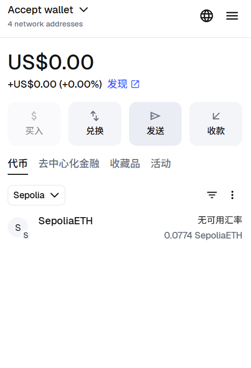

地址填上一步生成的合约的地址。
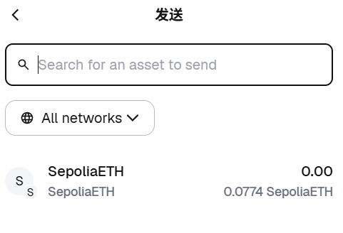

你可以通过转账活动来查看是否成功：
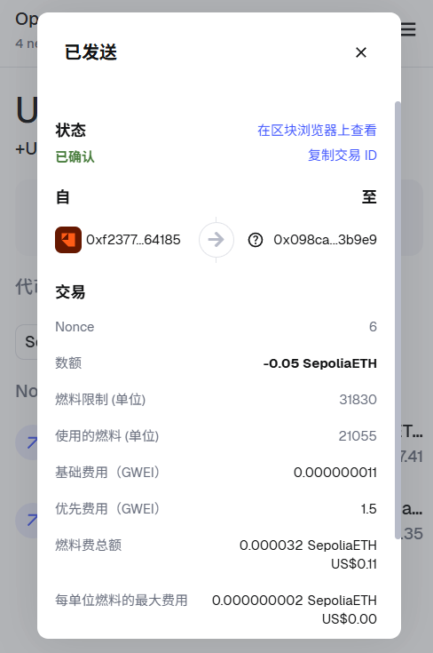


## 编写链下 Python 脚本

在 ~/contract/offchain_scripts/ 目录下创建一个新文件 trigger_transfer.py，并将以下代码粘贴进去。

```python
import os
import json
from web3 import Web3
from dotenv import load_dotenv

def main():
    """
    主执行函数：加载配置、构建交易、签名并发送。
    """
    
    print("--- 链下 Python 脚本启动 ---")

    # 1. --- 加载配置 ---
    env_path = os.path.join(os.path.dirname(__file__), '..', '.env')
    load_dotenv(env_path)
    
    abi_path = os.path.join(os.path.dirname(__file__), '..', 'artifacts', 'contracts', 'Executor.sol', 'Executor.json')
    
    try:
        with open(abi_path, 'r') as f:
            artifact = json.load(f)
        abi = artifact['abi']
    except FileNotFoundError:
        print(f"错误: 找不到 ABI 文件。请确保已编译合约: {abi_path}")
        return

    rpc_url = os.getenv("SEPOLIA_RPC_URL")
    wallet_a_key = os.getenv("WALLET_A_PRIVATE_KEY")
    wallet_b_addr_raw = os.getenv("WALLET_B_ADDRESS")
    contract_addr_raw = os.getenv("CONTRACT_ADDRESS")
    
    if not all([rpc_url, wallet_a_key, wallet_b_addr_raw, contract_addr_raw]):
        print("错误: .env 文件中的变量不完整。")
        return

    print(f"已加载配置：")
    print(f"  RPC 节点: {rpc_url[:25]}...")

    # 2. --- 连接到区块链 ---
    w3 = Web3(Web3.HTTPProvider(rpc_url))
    if not w3.is_connected():
        print("错误: 无法连接到 Sepolia RPC 节点。")
        return
    
    chain_id = w3.eth.chain_id
    print(f"成功连接到链 ID: {chain_id} (Sepolia 应为 11155111)")

    # 2b. --- 转换地址为校验和格式 ---
    try:
        wallet_b_addr = w3.to_checksum_address(wallet_b_addr_raw)
        contract_addr = w3.to_checksum_address(contract_addr_raw)
        print(f"  合约地址 (校验和): {contract_addr}")
        print(f"  目标 (Wallet B) (校验和): {wallet_b_addr}")
    except ValueError as e:
        print(f"错误: .env 文件中的地址无效: {e}")
        return

    # 3. --- 设置签名账户 (Wallet A) ---
    account_a = w3.eth.account.from_key(wallet_a_key)
    w3.eth.default_account = account_a.address
    print(f"签名账户 (Wallet A): {account_a.address}")

    # 4. --- 实例化合约 ---
    executor_contract = w3.eth.contract(address=contract_addr, abi=abi)

    # 5. --- 定义交易参数 (链下决策) ---
    amount_to_send_eth = 0.0001
    amount_to_send_wei = w3.to_wei(amount_to_send_eth, 'ether')
    
    print("---------------------------------")
    print(f"决策：准备从合约向 Wallet B 发送 {amount_to_send_eth} ETH...")

    # 6. --- 构建、签名并发送交易 ---
    try:
        print("正在构建交易 (调用 executeTransfer)...")
        
        tx_call = executor_contract.functions.executeTransfer(
            wallet_b_addr,
            amount_to_send_wei
        )

        transaction = tx_call.build_transaction({
            'from': account_a.address,
            'nonce': w3.eth.get_transaction_count(account_a.address),
            'gas': 100000,
            'maxFeePerGas': w3.to_wei('50', 'gwei'),
            'maxPriorityFeePerGas': w3.to_wei('2', 'gwei'),
        })

        print("正在使用 Wallet A 的私钥签名交易...")
        signed_tx = w3.eth.account.sign_transaction(transaction, wallet_a_key)

        print("正在将已签名的交易发送到 Sepolia 网络...")
        
        tx_hash_bytes = w3.eth.send_raw_transaction(signed_tx.raw_transaction)

        # (关键修正!)
        # 1. 将 HexBytes 转换为标准十六进制字符串 (不带 0x)
        tx_hash_hex = tx_hash_bytes.hex()
        # 2. 手动添加 '0x' 前缀，确保链接 100% 正确
        tx_hash_with_prefix = f"0x{tx_hash_hex}"

        print(f"交易已发送! Tx Hash: {tx_hash_with_prefix}")
        print("正在等待交易回执 (这可能需要 15-30 秒)...")

        tx_receipt = w3.eth.wait_for_transaction_receipt(tx_hash_bytes)

        print("---------------------------------")
        if tx_receipt.status == 1:
            print("✅ 交易成功!")
            print(f"区块号: {tx_receipt.blockNumber}")
            print(f"Gas 消耗: {tx_receipt.gasUsed}")
            print("--- 验证链接 ---")
            print(f"在 Etherscan 上查看你的交易:")
            # (使用我们手动修正的、带 '0x' 的哈希)
            print(f"https://sepolia.etherscan.io/tx/{tx_hash_with_prefix}")
        else:
            print(f"❌ 交易失败! 回执: {tx_receipt}")

    except Exception as e:
        print(f"\n--- ❌ 发生错误 ---")
        if "insufficient funds" in str(e).lower():
            print("错误: 你的 Wallet A (0xf237...) 没有足够的 Sepolia ETH 来支付 Gas 费用。")
            print("请确保你的 Wallet A 有 ETH 来支付调用合约的 Gas。")
        else:
            print(f"错误详情: {e}")

if __name__ == "__main__":
    main()
```

然后在终端运行：
```bash
cd ~/contract
source py_env/bin/activate
python3 offchain_scripts/trigger_transfer.py
```

返回是：
```bash
(py_env) root@iZ6webc8hc63rvskqsh8uhZ:~/contract# python3 offchain_scripts/trigger_transfer.py
--- 链下 Python 脚本启动 ---
已加载配置：
  RPC 节点: https://eth-sepolia.g.alc...
成功连接到链 ID: 11155111 (Sepolia 应为 11155111)
  合约地址 (校验和): 0x098ca3659853743d4c6bf166FbF1dfb94Dc3b9e9
  目标 (Wallet B) (校验和): 0x4d90A7E1BBA47CEC28678167F8e6E3988b295df1
签名账户 (Wallet A): 0xf2377774C453FCdba9d929C193f094e912664185
---------------------------------
决策：准备从合约向 Wallet B 发送 5e-05 ETH...
正在构建交易 (调用 executeTransfer)...
正在使用 Wallet A 的私钥签名交易...
正在将已签名的交易发送到 Sepolia 网络...
交易已发送! Tx Hash: ec847b2c05d55d90b993f6570ed866d42690d409d4693eb6ac1ac2123cf8787f
正在等待交易回执 (这可能需要 15-30 秒)...
---------------------------------
✅ 交易成功!
区块号: 9611221
Gas 消耗: 34233
--- 验证链接 ---
在 Etherscan 上查看你的交易:
https://sepolia.etherscan.io/tx/0xec847b2c05d55d90b993f6570ed866d42690d409d4693eb6ac1ac2123cf8787f
```

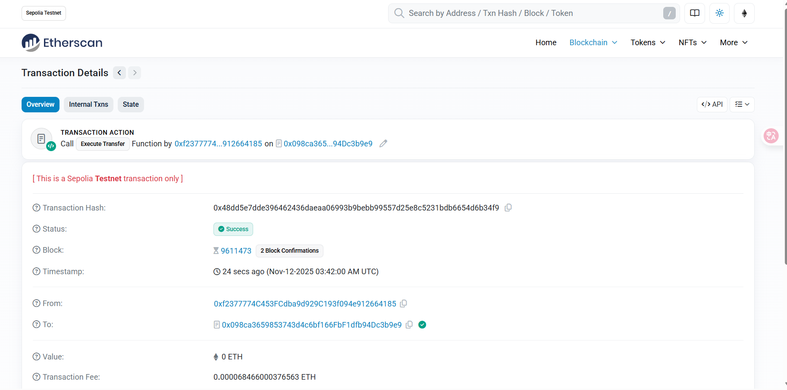

你可能会好奇为什么从metamask查看钱包B的交易却看不到，这是因为这个交易是合约发出的。但是值实实在在变化了。
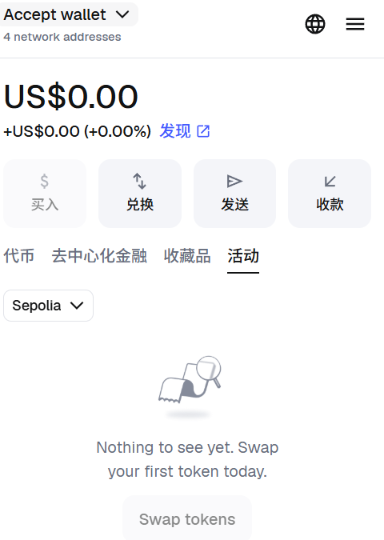

## 总结

1.  **原型成功：** 我们成功实现了链下 Python 脚本对链上合约的安全调用，完成了资金的程序化转移。
2.  **关键启示：**
    * **Hardhat v3 模板的陷阱：** 不同的 Hardhat v3 模板（如 `mocha-ethers`）可能存在环境注入不一致的问题。`hre` 并不总是像 v2 中那样可靠。
    * **`pure ethers.js` 是可靠的后备方案：** 当 Hardhat 的辅助工具（`hre`）失败时，返回到底层的 `ethers.js` 库（手动管理 Provider, Wallet, Factory）是 100% 可靠的部署策略。
    * **`web3.py` (v6+) 的严格性：** 新版 `web3.py` 在“校验和地址 (EIP-55)”和“PEP 8 命名” (`raw_transaction`) 方面非常严格。
    * **RPC 节点不是绝对可信的：** 节点可能会返回“虚假”的成功回执（“幽灵交易”）。Etherscan 是最终的真相来源。
    * **Etherscan (UI) 的局限性：** 钱包 UI（如 MetaMask）可能无法正确显示“内部交易”。**最终的真相始终是链上状态（账户余额）**。